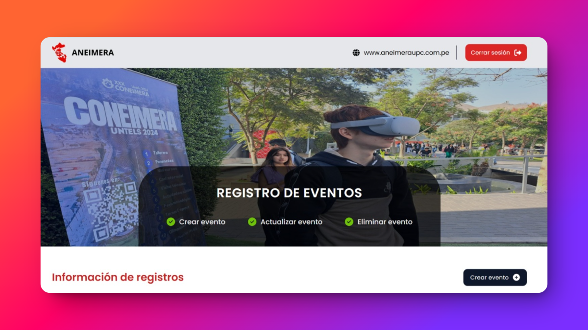
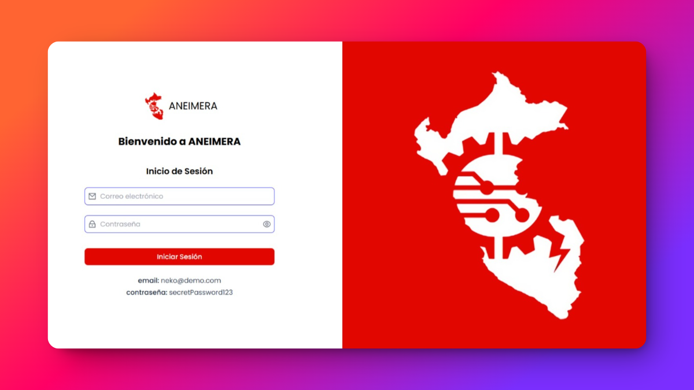
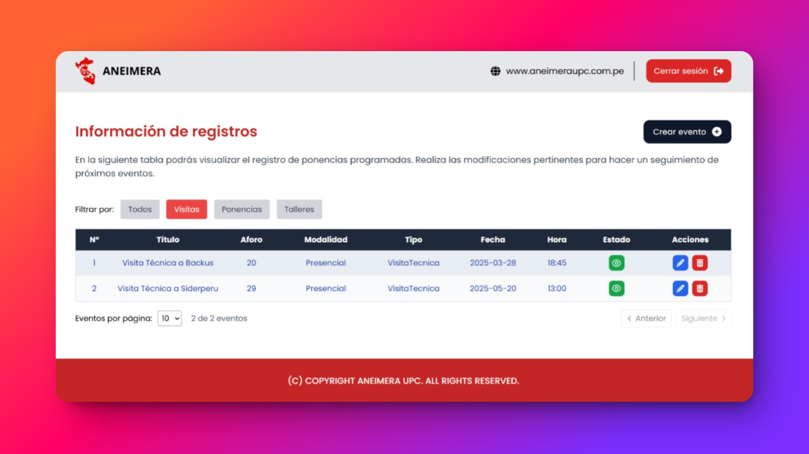
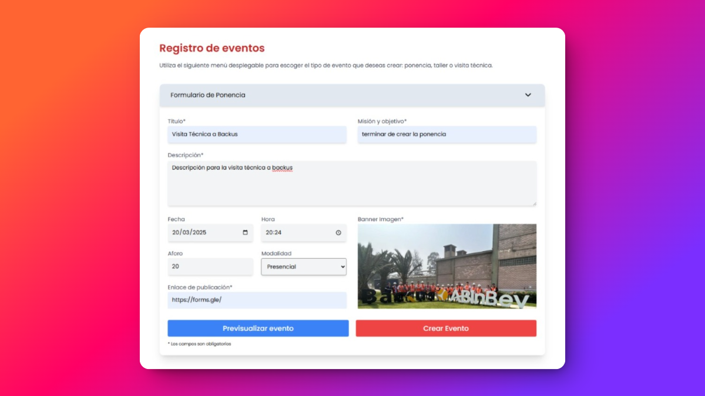
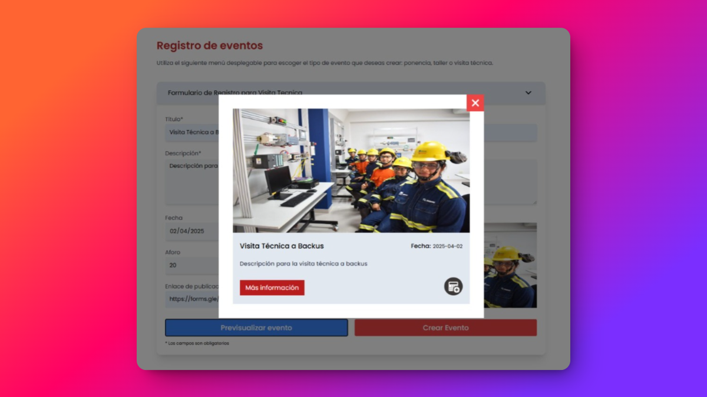

<p align="center">
  <a href="" rel="noopener">
 </a>
</p>
<h3 align="center">ANEIMERA UPC Platform</h3>

---

<p align="center">
    Plataforma administrativa para la gestión de eventos de ANEIMERA UPC, permitiendo la creación, actualización y eliminación de eventos, así como el control de su visibilidad en la <a href="https://aneimera-upc-demo.vercel.app/AneimeraPeruPage">página oficial</a> 
    <br>
    <br> 
</p>


## 📝 Table of Contents

- [📝 Table of Contents](#-table-of-contents)
- [🧐 Problem Statement ](#-problem-statement-)
- [💡 Solution ](#-solution-)
- [🚀 How Does It Work? ](#-how-does-it-work-)
- [🏁 Getting Started ](#-getting-started-)
  - [1️⃣ Clonar el repositorio](#1️⃣-clonar-el-repositorio)
  - [2️⃣ Instalar dependencias](#2️⃣-instalar-dependencias)
  - [3️⃣ Configurar variables de entorno](#3️⃣-configurar-variables-de-entorno)
  - [4️⃣ Iniciar el servidor de desarrollo](#4️⃣-iniciar-el-servidor-de-desarrollo)
- [🎨 Screenshots \& Previews ](#-screenshots--previews-)
  - [🏠 Hero de la Aplicación](#-hero-de-la-aplicación)
  - [🔑 Página de Inicio de Sesión](#-página-de-inicio-de-sesión)
  - [📋 Tabla de Eventos](#-tabla-de-eventos)
  - [📅 Creacion de Evento](#-creacion-de-evento)
  - [🔍 Vista Previa de la Aplicación](#-vista-previa-de-la-aplicación)
- [📐 Project Structure ](#-project-structure-)
- [⛏️ Technology Stack ](#️-technology-stack-)
- [✍️ Authors ](#️-authors-)

## 🧐 Problem Statement <a name = "problem_statement"></a>

Los directivos de la asociación ANEIMERA UPC necesitaban una plataforma para gestionar de manera eficiente la creación, actualización y eliminación de eventos. Esta plataforma debía permitir organizar actividades como talleres, ponencias y visitas técnicas a universidades y organizaciones, asegurando una administración centralizada y accesible.

El objetivo principal era desarrollar un sistema que optimizara la gestión de eventos, facilitando su planificación y seguimiento, y permitiendo a la directiva mantener información actualizada sobre las actividades programadas.

## 💡 Solution <a name = "solution"></a>

Para optimizar la gestión de eventos, se propone el desarrollo de una plataforma administrativa que permita a la directiva de <b>ANEIMERA UPC</b> crear, actualizar y eliminar eventos de manera eficiente. Además, la plataforma permitirá gestionar la visibilidad y vigencia de los eventos en la página oficial de la asociación.  

Con el fin de garantizar la seguridad de la información, la plataforma incluirá una capa de acceso restringido exclusivamente para la directiva, asegurando un manejo seguro y centralizado de los datos. Esto permitirá una administración efectiva de las actividades, facilitando su planificación y manteniendo la información actualizada en todo momento.  


## 🚀 How Does It Work? <a name = "future_scope"></a>

- La directiva accede a la plataforma mediante credenciales seguras.  
- Se pueden crear, actualizar o eliminar eventos a través de una interfaz intuitiva.  
- Los eventos pueden configurarse con fechas de vigencia y visibilidad en la página oficial de ANEIMERA UPC.  
- Un sistema de permisos restringe el acceso solo a la directiva, asegurando la protección de la información.  
- Los datos de los eventos se almacenan y gestionan de forma segura para evitar pérdidas o modificaciones no autorizadas.  
- La plataforma permite un seguimiento eficiente de eventos pasados y próximos, facilitando la planificación y organización de actividades.  

## 🏁 Getting Started <a name = "getting_started"></a>

### 1️⃣ Clonar el repositorio  
Abre una terminal y ejecuta: 

```bash
git clone https://github.com/Nekolas777/aneimera-upc-frontend.git
cd aneimera-upc-frontend
```

### 2️⃣ Instalar dependencias
Instala las dependencias del proyecto ejecutando:

```bash
npm install
```

### 3️⃣ Configurar variables de entorno
Copia el archivo `.env.template` a `.env` y ajusta las variables de entorno según sea necesario:

```bash
cp .env.template .env
```

### 4️⃣ Iniciar el servidor de desarrollo
Inicia el servidor de desarrollo ejecutando:

```bash
npm run dev
```

Ahora puedes abrir tu navegador y navegar a `http://localhost:3000` para ver la aplicación en funcionamiento.

## 🎨 Screenshots & Previews <a name="screenshots"></a>

### 🏠 Hero de la Aplicación  


### 🔑 Página de Inicio de Sesión  


### 📋 Tabla de Eventos  


### 📅 Creacion de Evento  


### 🔍 Vista Previa de la Aplicación  



## 📐 Project Structure <a name="project_structure"></a>

```
.
└── src
    ├── assets
    │   # Contiene recursos estáticos como imágenes y estilos.
    ├── features
    ├── auth
    │   ├── context
    │   │   # Contextos de autenticación para la gestión del estado global.
    │   ├── hooks
    │   │   # Hooks personalizados relacionados con autenticación.
    │   ├── model
    │   │   # Modelos de datos para la autenticación.
    │   ├── pages
    │   │   # Páginas relacionadas con autenticación (login, registro, recuperación de contraseña, etc.).
    │   └── service
    │       # Servicios para manejar autenticación y llamadas a la API.
    │       
    ├── events
    │   ├── components
    │   │   # Componentes reutilizables para la gestión de eventos.
    │   ├── hooks
    │   │   # Hooks personalizados relacionados con eventos.
    │   ├── model
    │   │   # Modelos de datos para eventos.
    │   ├── pages
    │   │   # Páginas donde se muestran y gestionan eventos.
    │   ├── routes
    │   │   # Definición de rutas específicas para eventos.
    │   └── service
    │       # Servicios para la gestión de eventos y conexión con la API.
    │
    ├── public
    │   # Contiene archivos públicos como index.html e íconos.
    ├── router
    │   # Configuración y gestión de rutas de la aplicación.
    ├── shared
    │   # Elementos compartidos como utilidades, helpers y tipos globales.
    └── main.tsx
        # Archivo principal que monta la aplicación en React.
```

## ⛏️ Technology Stack <a name = "tech_stack"></a>

- [TypeScript](https://www.typescriptlang.org/) - Superset de JavaScript que añade tipado estático.  
- [React](https://react.dev/) - Biblioteca de JavaScript para la construcción de interfaces de usuario.  
- [React Router](https://reactrouter.com/) - Biblioteca para la gestión de rutas en aplicaciones React.  
- [Vite](https://vitejs.dev/) - Herramienta de desarrollo para construir aplicaciones rápidas con React.  
- [Tailwind CSS](https://tailwindcss.com/) - Framework de CSS para el diseño de interfaces con clases utilitarias.  

## ✍️ Authors <a name = "authors"></a>

- [@Nekolas777](https://github.com/Nekolas777)
- [@sergio185678](https://github.com/sergio185678)
- [@asotito](https://github.com/asotito)
- [@KevinDextreMiguel](https://github.com/KevinDextreMiguel)